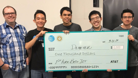
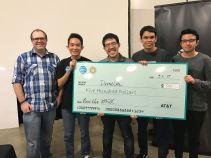

## Intro
Hello everyone,

Sorry for not updating my blog in a while. For one of my classes, I was required to create a professional portfolio (separate from this site) and post blog-like essays almost every week. This caused me to focus my writing on the portfolio created for class instead of my own personal website on here. I did, however, end up writing a lot of content on that site. You can check it out [here](http://brianmayeshiro.github.io).

Moving forward, I’m redirecting my attention back to writing blogs on here. I’m setting a new goal for myself this Summer to write a blog at least once a month 😊

Now the semester is finally over with, I’d like to take the time to write about my experiences at two major events I attended this Spring: The Game Developers Conference and the AT&T Hackathon.
## GDC
<blockquote class="twitter-tweet" data-lang="en">
Day 1 of the Independent Games Summit and GDC 2017 is over. Looking forward to the rest of the week 😁 <a href="https://t.co/Hv3JEfvQfj">pic.twitter.com/Hv3JEfvQfj</a>
&mdash; Brian Mayeshiro (@BrianMayeshiro) <a href="https://twitter.com/BrianMayeshiro/status/836411497425186816?ref_src=twsrc%5Etfw">February 28, 2017</a></blockquote>

In late February, I had the amazing opportunity to attend the Game Developers Conference (GDC) in San Francisco, California. For those unaware, GDC one of the largest Industry-level events “where programmers, artists, producers, game designers, audio professionals, business decision-makers and others involved in the development of interactive games and virtual reality gather to exchange ideas and shape the future of the industry” [http://www.gdconf.com/aboutgdc/](http://www.gdconf.com/aboutgdc/). Having bought an Indie Games Summit pass, I was able to attend talks by industry professionals, network, and visit the expo. I got my “foot in the door” and gained the confidence to network with professionals by the end of the week-long conference.

Out of all the talks I attended, the one that stood out the most was from Samuel Coster with his talk titled “The Last Game I Make Before I Die: The ‘Crashlands’ Postmortem”. The talk was about his journey through making Crashlands while fighting cancer at the same time. His story impacted me on an emotional level and at the end of his talk, we all gave him well deserved standing ovation. It’s inspiring to watch someone, like Samuel, develop the courage to share their darkest moments and how they overcame it. Thank you, Samuel for sharing your story.

With the amount of talks, free resources (in addition to the free stuff from the expo), and networking opportunities, I highly recommend anyone who’s interested in working in the Games Industry to attend this event. As an aspiring game developer, the atmosphere of the event made me feel like I belonged. It feels great to be a part of a community that’s incredibly passionate about games.

After the conference was over, I got the chance to hang out with some friends in the area 😃
## AT&T Hackathon
<blockquote class="twitter-tweet" data-lang="en">
.<a href="https://twitter.com/ATT?ref_src=twsrc%5Etfw">@ATT</a> hackathon time 😬 <a href="https://t.co/lgo0gNUDlj">pic.twitter.com/lgo0gNUDlj</a>
&mdash; Brian Mayeshiro (@BrianMayeshiro) <a href="https://twitter.com/BrianMayeshiro/status/840410618792370176?ref_src=twsrc%5Etfw">March 11, 2017</a></blockquote>

<blockquote class="twitter-tweet" data-lang="en">
Almost done! Thanks <a href="https://twitter.com/RevaComm?ref_src=twsrc%5Etfw">@RevaComm</a> for allowing us to use your space :) <a href="https://twitter.com/hashtag/ATThack?src=hash&amp;ref_src=twsrc%5Etfw">#ATThack</a> <a href="https://twitter.com/hashtag/2laptopTerry?src=hash&amp;ref_src=twsrc%5Etfw">#2laptopTerry</a> <a href="https://t.co/FaGYkfeo0S">pic.twitter.com/FaGYkfeo0S</a>
&mdash; Brian Mayeshiro (@BrianMayeshiro) <a href="https://twitter.com/BrianMayeshiro/status/840744932826525696?ref_src=twsrc%5Etfw">March 12, 2017</a></blockquote>

A week after returning home from my trip, I participated in the AT&T 24-hour Hackathon competition held by the AT&T Developer Program and the University of Hawaii.

<blockquote class="twitter-tweet" data-lang="en">
Linux on Raspberry pi 😮 (not the edible kine) <a href="https://twitter.com/hashtag/ATThack?src=hash&amp;ref_src=twsrc%5Etfw">#ATThack</a> <a href="https://t.co/vtfXtEJwBL">pic.twitter.com/vtfXtEJwBL</a>
&mdash; Brian Mayeshiro (@BrianMayeshiro) <a href="https://twitter.com/BrianMayeshiro/status/840463119130411008?ref_src=twsrc%5Etfw">March 11, 2017</a></blockquote>

With no prior planning for the Hackathon, I joined my friend’s group at the last minute. Our group’s app, <em>Demeter</em>, was a gamified mobile app geared towards rewarding people for taking care of their plants. My role for this project was to setup the Raspberry Pi with the sensors that kept track of the data we were using for the app. The data would be stored through AT&T’s M2X API and updated in real time. The three sensors were used to track light, humidity, and temperature. We used the data from these sensors to determine whether the user is taking proper care of their plants and rewarded those that did with achievements.

<blockquote class="twitter-tweet" data-lang="en">
Team Demeter pitching their IOT Green thumb solution at <a href="https://twitter.com/hashtag/atthack?src=hash&amp;ref_src=twsrc%5Etfw">#atthack</a> in Honolulu <a href="https://twitter.com/hashtag/attemp?src=hash&amp;ref_src=twsrc%5Etfw">#attemp</a> <a href="https://t.co/oRLLAOw6Id">pic.twitter.com/oRLLAOw6Id</a>
&mdash; Benjamin Nelson (@Benelson83) <a href="https://twitter.com/Benelson83/status/840790739881611265?ref_src=twsrc%5Etfw">March 12, 2017</a></blockquote>

After long and gruesome 24 hours, we gave our demo in front of the judges…

   

…and it paid off! Our group won 1st place for the “Best use of M2X API” and “Best use of IOT” (internet of things). Also, I won an AT&T Trek 2 tablet for the <a href="https://twitter.com/BrianMayeshiro/status/840463119130411008" target="_blank" rel="noopener noreferrer">best tweet</a> during the event! I’d like to give special thanks to <a href="https://twitter.com/RevaComm">RevaComm</a> for allowing us to use their workspace and especially give thanks to my teammates. They are the true MVPs.

Press coverage of the Hackathon:

<a href="https://www.ics.hawaii.edu/2017/03/ics-students-win-big-at-att-hackathon/" target="_blank" rel="noopener noreferrer">ICS Students Win Big at ATT Hackathon</a>

Tweets made during event:

<a href="https://twitter.com/i/moments/847720281808420865" target="_blank" rel="noopener noreferrer">https://twitter.com/i/moments/847720281808420865</a>
## What's next?
Well that was a lot of ground to cover, but thank you for taking the time to read my blog. With the semester being over I’d like to redirect my attention back on my plans for the Summer and start preparing for the upcoming months. I’ve been receiving a lot of questions regarding my Summer plans, so I’d like to address this through an <strong>announcement on Wednesday, May 31st</strong>.

Take care,

-Brian

Be sure to follow me on Twitter <a href="https://twitter.com/BrianMayeshiro">@BrianMayeshiro</a> to stay up-to-date.
