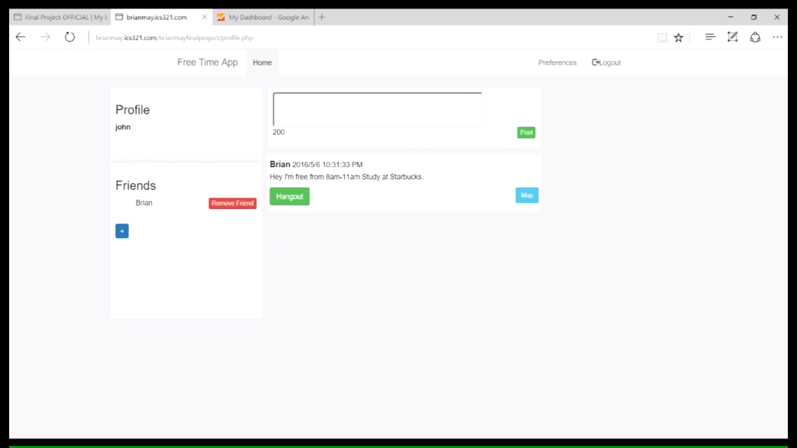

The goal of the final project in ICS 321 was to create a practical web application that demonstrated our understanding in using databases. As a result, my partner (Shengyuan Su) and I came up with the idea of developing an app that would help its users organize professional/recreational meetings. The application is setup very similarly to Twitter in terms of the method to display posts and reacting to a person's post. However, our application distinguishes a clear difference from Twitter by implementing a private social network.

For this project, my role consisted of mainly front-end tasks such as designing the UI and configuring the buttons. I sometimes worked with the database functions since I needed to link the databases properly with every button function. Mapping out the buttons turned out to be more challenging in terms of the user experience when using the app because the main buttons in our app were color-coded red and green. Highlighting over a button that changed to red symbolized that pressing the button would perform the negative action of opting out of the person's meeting while highlighting over a button that changed to green symbolized performing a positive action of joining the meeting.

After completing this project I learned about the complexities that can result from using databases in an application. Since our application was inspired by Twitter, I learned about some of the backend details that the average user would probably not notice. Also, I gained a fundamental understanding of web programming languages like JavaScript, HTML, PHP, and CSS. To help me in configuring the buttons, I learned to use a 3rd party tool called *Bootstrap*.

## Demo Video

[Link to source code](https://github.com/brianmayeshiro/ICS321FREETIMEAPP).

