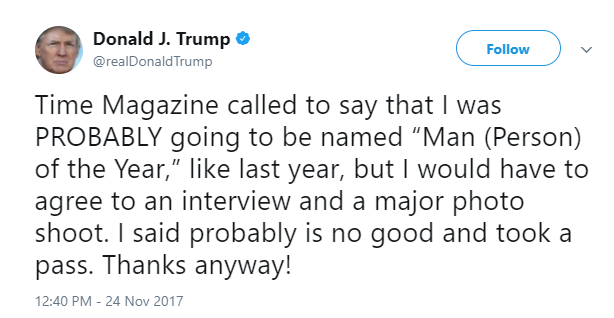
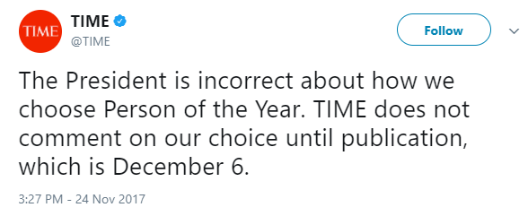
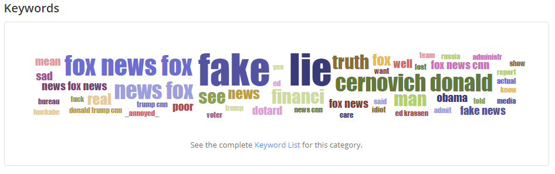

## Background
The Oxford Dictionary defines Sentiment analysis as "the process of computationally identifying and categorizing opinions expressed in a piece of text, especially in order to determine whether the writer's attitude towards a particular topic, product, etc. is positive negative, or neutral".

In machine learning, sentiment analysis uses a combination of NLP, statistics, classification algorithm(s) to help characterize the text in terms of sentiment. In this case, sentiment analysis will be run on a set of tweets that mention the account: @realDonaldTrump.

**So, what happens when you run sentiment analysis on tweets about Donald Trump?**

## Method
* Sentiment Analysis using MonkeyLearn and SVM as the machine learning algorithm for the classification
* Using 302 Tweets that included “@realDonaldTrump” from 11/24/17 to 11/25/17 (24hrs)
  * Manually classified as positive, negative, or neutral
  * Ran 5 trials of the SVM classifier on the same 302 tweets
* Tweets were data-mined using Tweepy Python package
* Analysis:
  * Determining if a tweet is positive, negative, or neutral
  * Determining the most used words

## Results

### Positive, Negative, and Neutral Tweets
Average Accuracy: 85.8%

### Keywords
The keywords gathered from MonkeyLearn; words in larger font appeared more frequently.

## Conclusion
The results indicated that tweets which mention @realDonaldTrump were overwhelmingly negative, which could have caused the 14.2%  of misclassified tweets. If the data set were more equal, it could have given a higher accuracy for classification. However, when classifying the tweets, the multi-class SVM had an average accuracy of 85.8% in the classification of the set of 302 tweets. The consistent accuracy in classification might indicate that sentiment analysis can be used to classify tweets, assuming that the sample size contains a lot of keywords which pertain to either positive, negative, or neutral.

## References
Code: [http://ipullrank.com/step-step-twitter-sentiment-analysis-visualizing-united-airlines-pr-crisis/](http://ipullrank.com/step-step-twitter-sentiment-analysis-visualizing-united-airlines-pr-crisis/)

Tweepy Documentation: [https://media.readthedocs.org/pdf/tweepy/latest/tweepy.pdf ](https://media.readthedocs.org/pdf/tweepy/latest/tweepy.pdf)

Sentiment Analysis Definition: [https://en.oxforddictionaries.com/definition/sentiment_analysis ](https://en.oxforddictionaries.com/definition/sentiment_analysis)
