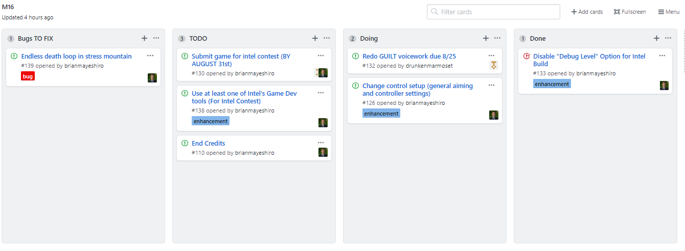

## Background
Made in [Unity C#](https://unity3d.com/) and the [Corgi Engine](http://corgi-engine.moremountains.com/), White Tulip (WT) is a 2D Puzzle Platformer about overcoming Depression and PTSD.

Inspired by true events, WT follows the story of a mysterious hooded character that travels through a world representative of symptoms associated with Depression and PTSD. As you play as our hero, you will be accompanied by Mortimer: a reflection of our hero’s inner demons but is the only friend you have. Our hope with telling this story is to inspire others to join the fight against mental illness and overcome the struggles that come with it.

The pre-production phase of this project begun in the Summer of 2016 but did not begin full scale production until 2017. White Tulip is expected to be complete by the end of 2018 and will release on [Steam](https://store.steampowered.com/) and [Itch.io]( https://itch.io/) for PC and MacOS devices. All profits from the sale of WT will be donated to the [American Foundation for Suicide Prevention](https://afsp.org/).

<blockquote class="imgur-embed-pub" lang="en" data-id="sfsFguu"></blockquote>

## Current Team
- Fernando Angelo (2D Pixel Artist)
- Jeremiah French (Writer and Sound Designer)
- Brian Mayeshiro (Project Lead and Programmer)

## Making White Tulip
Example of the use of shaders in WT
<blockquote class="imgur-embed-pub" lang="en" data-id="a/rHsa1w8"></blockquote>

Project Management was assisted through GitHub's project card system

Example of the saving and loading feature implemented using the scripts provided in the Corgi Engine
<blockquote class="imgur-embed-pub" lang="en" data-id="NNdcXNF"><a href="//imgur.com/NNdcXNF">White Tulip Alpha Main Menu Example</a></blockquote>

## Sample Gameplay

<blockquote class="imgur-embed-pub" lang="en" data-id="a/i5vuo"><a href="//imgur.com/i5vuo">Gameplay clip</a></blockquote>

## Builds
Alpha (completed by August 31st, Intel Game Testing Contest submission)

Facebook: [@WhiteTulipGame](https://www.facebook.com/whitetulipgame/)

Twitter: [@WhiteTulipGame](https://twitter.com/WhiteTulipGame)

